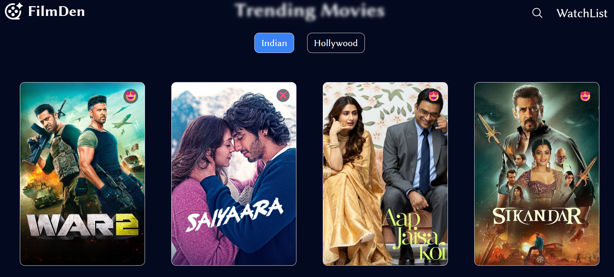
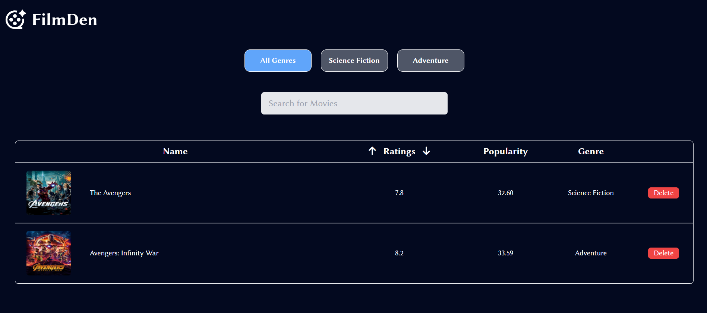

# 🎬 FilmDen — Movie Discovery & Watchlist App 🌐

**FilmDen** is a React-based web application for exploring, discovering, and managing movies across different languages and regions. It provides trending movie lists, search functionality, and personalized watchlists for a seamless movie browsing experience.

---

## 🚀 Features
- 🎥 Browse trending movies from Indian & Hollywood cinema
- 🔍 Search movies by title
- ⭐ Add or remove movies from your personal **WatchList**
- 🗂️ Filter WatchList by genre and sort by ratings or popularity
- 📱 Fully **responsive design** for mobile and desktop

---

## 💻 Tech Stack

| Layer      | Technology                           |
|------------|--------------------------------------|
| Frontend   | React.js, Tailwind CSS               |
| State Mgmt | React `useState`, `useEffect`        |
| Routing    | React Router v6                      |
| API        | TheMovieDB API                       |

---

## 📸 Screenshots

**Home Page**  

**Movies Page**  

**Movie Details Page**  

**WatchList Page**  

---

## 🔗 Live Demo
👉 [Visit FilmDen](https://filmden.vercel.app/)

---

## 👨‍💻 Creator
**Amarjeet Mahapatra**  
💼 Full-Stack Web Developer | MERN Stack Enthusiast  
📍 Navi Mumbai, India  
🔗 GitHub: [Amar-6003](https://github.com/Amar-6003)  
🔗 LinkedIn: [Amarjeet Mahapatra](https://www.linkedin.com/in/amar6003)
